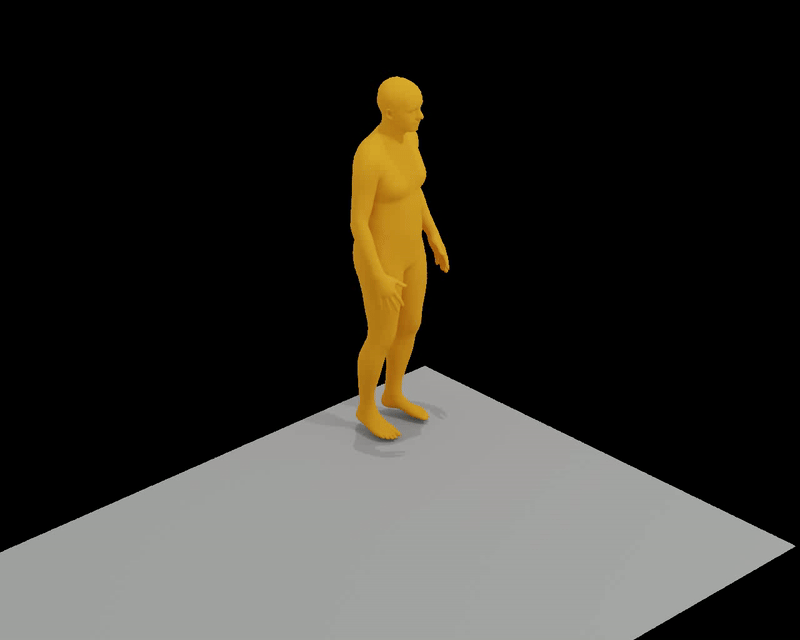
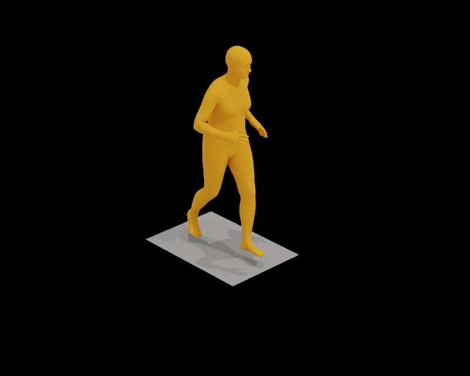

# Enhancing Text-to-Motion Synthesis through Language Models

## Demo
Our approach can enhance output motion quality by adding contextually relevant text signals or by translating high-level motion descriptions to a set of low-level motion descriptions.
In the following, we show 3 examples for qualitative improvements of the generated motion and one example for a degradation, where the LLM omitted important information.
Note that we subsequently built a quality check stage to minimize the occurrence of such refinement failures.

<table style="width: 100%; border-collapse: collapse;">
  <tr>
    <th style="border: 1px solid #ddd; padding: 8px; text-align: center; vertical-align: middle;">Ground Truth</th>
    <th style="border: 1px solid #ddd; padding: 8px; text-align: center; vertical-align: middle;">Unrefined (MoMask)</th>
    <th style="border: 1px solid #ddd; padding: 8px; text-align: center; vertical-align: middle;">Refined (Ours)</th>
  </tr>
  <tr>
    <td style="border: 1px solid #ddd; padding: 8px; text-align: center; vertical-align: middle;">
      
      <p style="max-width: 300px; margin: auto; word-wrap: break-word;">a person performs a typical broadjump</p>
    </td>
    <td style="border: 1px solid #ddd; padding: 8px; text-align: center; vertical-align: middle;">
      
      <p style="max-width: 300px; margin: auto; word-wrap: break-word;">a person performs a typical broadjump</p>
    </td>
    <td style="border: 1px solid #ddd; padding: 8px; text-align: center; vertical-align: middle;">
      
      <p style="max-width: 300px; margin: auto; word-wrap: break-word;">The person bends their arms and crouches down preparing for a jump, then extend their arms back as they propel themselves forward with their legs.</p>
    </td>
  </tr>
  <tr>
    <td style="border: 1px solid #ddd; padding: 8px; text-align: center; vertical-align: middle;">
      
      <p style="max-width: 300px; margin: auto; word-wrap: break-word;">a figure winds up for the pitch</p>
    </td>
    <td style="border: 1px solid #ddd; padding: 8px; text-align: center; vertical-align: middle;">
      
      <p style="max-width: 300px; margin: auto; word-wrap: break-word;">a figure winds up for the pitch</p>
    </td>
    <td style="border: 1px solid #ddd; padding: 8px; text-align: center; vertical-align: middle;">
      
      <p style="max-width: 300px; margin: auto; word-wrap: break-word;">The figure pulls back their arms in preparation for throwing something.</p>
    </td>
  </tr>
  <tr>
    <td style="border: 1px solid #ddd; padding: 8px; text-align: center; vertical-align: middle;">
      
      <p style="max-width: 300px; margin: auto; word-wrap: break-word;">person is performing a golf motion</p>
    </td>
    <td style="border: 1px solid #ddd; padding: 8px; text-align: center; vertical-align: middle;">
      
      <p style="max-width: 300px; margin: auto; word-wrap: break-word;">person is performing a golf motion</p>
    </td>
    <td style="border: 1px solid #ddd; padding: 8px; text-align: center; vertical-align: middle;">
      
      <p style="max-width: 300px; margin: auto; word-wrap: break-word;">Imitating a golf swing, the person assumes a stance and clasps their hand together in a golf grip, leans forward to simulate a put motion that swings from left to right.</p>
    </td>
  </tr>
  <tr>
    <td style="border: 1px solid #ddd; padding: 8px; text-align: center; vertical-align: middle;">
      
      <p style="max-width: 300px; margin: auto; word-wrap: break-word;">a person slowly walks in a counter clockwise circle</p>
    </td>
    <td style="border: 1px solid #ddd; padding: 8px; text-align: center; vertical-align: middle;">
      
      <p style="max-width: 300px; margin: auto; word-wrap: break-word;">a person slowly walks in a counter clockwise circle</p>
    </td>
    <td style="border: 1px solid #ddd; padding: 8px; text-align: center; vertical-align: middle;">
      
      <p style="max-width: 300px; margin: auto; word-wrap: break-word;">The person's arms are relaxed and swing gently with each step.</p>
    </td>
  </tr>
</table>

Our approach can also enhance motion output quality for high-level motions not contained in the HumanML3D training data by utilizing the additional world knowledge of LLMs.

<table style="width: 100%; border-collapse: collapse;">
  <tr>
    <th style="border: 1px solid #ddd; padding: 8px; text-align: center; vertical-align: middle;">Unrefined (MoMask)</th>
    <th style="border: 1px solid #ddd; padding: 8px; text-align: center; vertical-align: middle;">Refined (Ours)</th>
  </tr>
  <tr>
    <td style="border: 1px solid #ddd; padding: 8px; text-align: center; vertical-align: middle;">
      
      <p style="max-width: 300px; margin: auto; word-wrap: break-word;">A man does the floss dance.</p>
    </td>
    <td style="border: 1px solid #ddd; padding: 8px; text-align: center; vertical-align: middle;">
      
      <p style="max-width: 300px; margin: auto; word-wrap: break-word;">A man moves his arms in parallel and always sideways in an alternating motion so that one arm is always behind and one in front of his body. The hands are always at hip level and his hips move in sync with his arms.</p>
    </td>
  </tr>
  <tr>
    <td style="border: 1px solid #ddd; padding: 8px; text-align: center; vertical-align: middle;">
      
      <p style="max-width: 300px; margin: auto; word-wrap: break-word;">A person does the running man dance.</p>
    </td>
    <td style="border: 1px solid #ddd; padding: 8px; text-align: center; vertical-align: middle;">
      
      <p style="max-width: 300px; margin: auto; word-wrap: break-word;">A person imitates slowly running in place with a very rhythmic motion. The head bumps in sync with the feet and the arms are supporting the running motion.</p>
    </td>
  </tr>
</table>

## Setup

<details>

### Clone Repo

This repo relies on submodules ([MoMask](https://github.com/EricGuo5513/momask-codes)). Pull the whole repo with
```
git clone --recurse-submodules https://github.com/mkiefferus/DigitalHumans
```
External repos are found in the folder `external_repos`

### Setup Repo
<details>

## 1. Conda Environment
We are using two different conda environments due to dependency conflicts, one for MoMask and one for Text Enhancement.
### MoMask Environment
```
cd external_repos/momask-codes
conda env create -f environment.yml
conda activate momask
pip install git+https://github.com/openai/CLIP.git
```

### Text Enhancement Environment
```conda env create -f environment_enhance.yml```
```conda activate enhance```

#### Alternative: Pip Installation
<details>
We provide an alternative pip installation in case you encounter difficulties setting up the conda environment. Please set up your two conda environments manually:

## MoMask Environment
```
cd external_repos/momask-codes
conda create -n "momask" python=3.7.13
conda activate momask
pip install -r requirements.txt
```
these are the most important packages:
- spacy
- torch
- tqdm
- openai

Furthermore, you will need to download the ```en_core_web_sm``` model:
```
python -m spacy download en_core_web_sm
```

## Text Enhancement Environment
```conda create -n "enhance" python=3.9.18```
```pip install -r requirements_enhance.txt```

</details>


*Disclaimer*: this section below is the setup section from [MoMask](https://github.com/EricGuo5513/momask-codes). Please follow the link for further details.
### 2. Models and Dependencies

#### Download Pre-trained Models
```
bash prepare/download_models.sh
```

#### Download Evaluation Models and Gloves
For evaluation only.
```
bash prepare/download_evaluator.sh
bash prepare/download_glove.sh
```

#### Troubleshooting
To address the download error related to gdown: "Cannot retrieve the public link of the file. You may need to change the permission to 'Anyone with the link', or have had many accesses". A potential solution is to run `pip install --upgrade --no-cache-dir gdown`, as suggested on https://github.com/wkentaro/gdown/issues/43. This should help resolve the issue.

#### (Optional) Download Manually
Visit [[Google Drive]](https://drive.google.com/drive/folders/1b3GnAbERH8jAoO5mdWgZhyxHB73n23sK?usp=drive_link) to download the models and evaluators mannually.

### 3. Get Data

You have two options here:
* **Skip getting data**, if you just want to generate motions using *own* descriptions.
* **Get full data**, if you want to *re-train* and *evaluate* the model.
* *(if eligible)* refined texts can be shared upon request

**(a). Full data (text + motion)**

**HumanML3D** - Follow the instruction in [HumanML3D](https://github.com/EricGuo5513/HumanML3D.git), then copy the result dataset to our repository:
```
cp -r ../HumanML3D/HumanML3D ./dataset/HumanML3D
```

*NOTE* the dataset folder is located in `external_repos/momask-codes/dataset`. 

**KIT**-Download from [HumanML3D](https://github.com/EricGuo5513/HumanML3D.git), then place result in `./dataset/KIT-ML`

</details>

### Setup API Token

This project relies on LLMs for text refinement. Accessing these LLMs is done via the OpenAI client. When working with local language models, skip this part. 

When working with OpenAI models (GPT3.5-turbo, GPT4o, ...):
Please create an OPENAI API Token and export it as a global variable to your system. ```OPENAI_API_KEY = ".."```
Follow the instructions given in _"Step 2 - Set up your API key for all projects (recommended)"_ in the [OpenAI API Documentation](https://platform.openai.com/docs/quickstart?context=python) to configure your OpenAI API access.

</details>


## Motion Description Refinement

<details>

*Remember to switch to our environment for text refinement*
```conda activate enhance```

Use the `text_enhance.py` script to refine motion descriptions. 
Specify the system prompt (to be found in the folder 'prompts') by its filename. Here are some example commands:
1. Text refinement using GPT-3.5 Turbo for the first 10 text files, here with the limb-specific refinement strategy
    ```
    python text_enhance.py --system_prompt limb_specific_v4 --use_example -r --verbose --early_stopping 10
    ```
2. Prompt enhancement by similarity search for the first 10 text files
    ```
    python text_enhance.py --prompt_adaptation similarity -r --verbose --early_stopping 10
    ```

#### Additional Useful Flags

* `-v, --verbose` : verbose
* `-s, --early_stopping` : early stopping - stop refinement after x steps for testing purposes

Text Refinement
* `-pa, --prompt_adaptation`: available options: similarity, regular
* `-sp, --system_prompt`: name of the system prompt to be given to the prompt adaptation model, see folder 'prompts' for options
* `--continue_previous`: continue refining texts from a specific folder
* `--refine_all_samples`: refine whole dataset, not only test-set (default)
* `--use_example`: add additional context with assistant/user example pairs
* `--samples_text_file`: text file specifying samples to refine, by default test.txt
* `--use_cross_sample_information`: treat sample text file as one motion (ignores batch size)
* `--use_llama`: use llama instead of GPT-3.5 Turbo (default). Requires to also provide `--llama_key <key>`
* `--batch_size`: specify how many files to batch to speed up refinement (not recommended, likely leads to less detailed added information and more format errors)

Quality control
* `-r` or `-d`: delete or replace with original refined files if they do not meet the quality control

</details>

## Train And Evaluate Your Own Model

<details>

*Remember to switch to the MoMask environment for training*
```conda activate momask```

Use the `t2m_train_eval.py` script to manage the evaluation and training of different text-to-motion models. The script provides various options for training specific models, resuming training, and evaluating models.
The text folder you specify with texts_folder_name should be located in 'external_repos/momask-codes/data/t2m'.

Find our pretrained MoMask models [here](https://polybox.ethz.ch/index.php/s/4HYSa8muWpa1w0H).

1. Train Masked Transformer Model end-to-end
    ```
    python t2m_train_eval.py --train_mask --texts_folder_name folder_name
    ```
2. Train Residual Transformer Model end-to-end
    ```
    python t2m_train_eval.py --train_res --texts_folder_name folder_name
    ```
3. Evaluate All Metrics
    ```
    python t2m_train_eval.py --eval_all_metrics --texts_folder_name folder_name
    ```
4. Evaluate Single Samples
    ```
    python t2m_train_eval.py --eval_single_samples --texts_folder_name folder_name
    ```

### Additional Useful Flags

The model folders should all be located in 'external_repos/momask-codes/checkpoints/t2m'

* `--res_name`: Specify the Residual Transformer model to evaluate. Defaults to the original MoMask model.
* `--mask_name`: Specify the Masked Transformer model to evaluate. Defaults to the original MoMask model.
* `--texts_folder_name`: The name of the folder containing the texts to be used for training or evaluation.
* `-tm, --train_mask`: Set if you want to train the Masked Transformer end-to-end
* `-tr, --train_res`: Set if you want to train the Residual Transformer end-to-end
* `--eval_single_samples`: Whether to generate a multimodal distance score for each sample in the dataset.
* `-v`, `--verbose`: Output information to the console (True) or the logfile (False).
* `-r`, `--resume_training`: Resume training that was stopped before.

</details>

## Visualization

<details>

To render SMPL animations and images in our paper, we used the [MotionGPT repository](https://github.com/OpenMotionLab/MotionGPT/tree/main).
In the visualization section of their README, they detail the necessary steps to set up a pipeline that can first fit SMPL meshes from NPY files produced by MoMask and subsequently produce animations using Blender.

</details>

## Results Analysis

<details>

*Remember to switch to our environment for results analysis*
```conda activate enhance```

This repo provides analysis scripts for post-processing under `result_analysis`. 

*Disclaimer* These scripts are not part of the original pipeline and were solely used to identify trends to optimise the text refinement and training further.

### BART Classifier

`BART_text_classifier.ipynb` leverages the [bart-large-mnli](https://huggingface.co/facebook/bart-large-mnli) model for zero-shot-classification. 

The `candidate_labels` variable holds a list with labels. The default confidence threshold is set to `THRESHOLD = 0.87`

Provide the link to the text samples folder unter `test_txt_path`. 

This is a multiclass classifier. It will label the data with the provided labels.

This script has the option to output the results to text files for further processing.


### Key-word Classifier

`filter_test_dataset.ipynb` filters test data based on keywords rather than using a classifier to label the test data. It currently tries to identify high level motion descriptions but also contains extensions to identify emotions, adjectives and limbs.

Adjust the `PROJECT_ROOT_DIR` and the path variables.

This script has the option to output the results to text files for further processing.


### Semantic Analysis

Refined texts produced by LLMs often include semantic errors (hallucinated information, removal of relevant information). `semantic_check.py` aims to find these mistakes and filter them out.

An LLM (default: llama3) is fed the original motion description and the refined description and asked if the texts are roughly equivalent.

Use 
```
python result_analysis/semantic_check.py --data path/to/texts/folder -r
```

#### Additional Useful Flags

* `--model` : define model to be used (supports 'llama3' and 'gpt-3.5-turbo')
* `-r` : replace faulty prompt refinements with original texts
* `-v` : verbose

### Score Trend Analysis

`single_sample_score_analysis.ipynb` compares the performance of the original text files vs the performance of the refined text files.

It also shows the top 10 improved motion descriptions and the top 10 degradations with respect to the original data.

Adjust the `original` and `altered` variables, providing the paths to the two datasets respectively. 

</details>


## CONTRIBUTORS
- [Anne Marx](https://github.com/An-nay-marks)
- [Axel Wagner](https://github.com/Axel2017)
- [Max Kieffer](https://github.com/mkiefferus)
- [Michael Siebenmann](https://github.com/TheSiebi)
