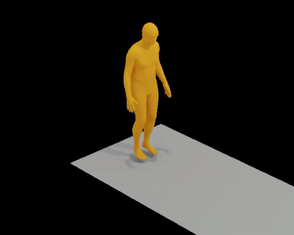
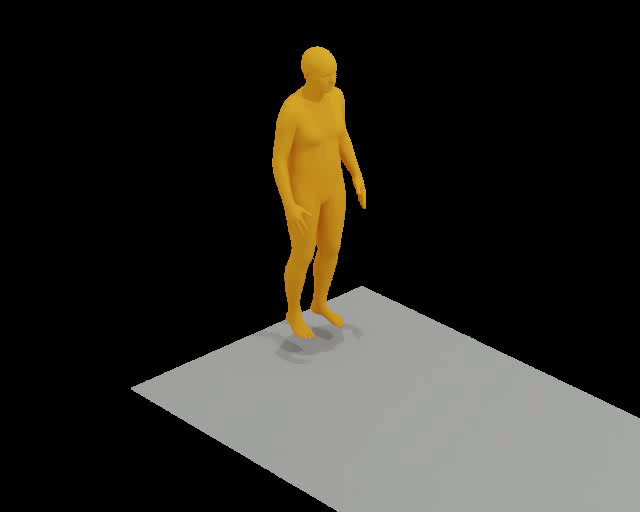
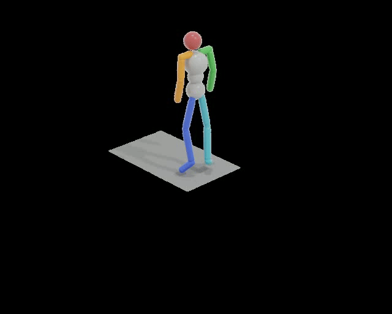
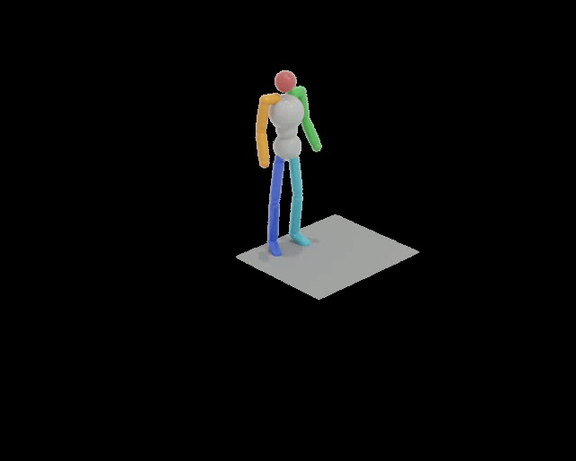
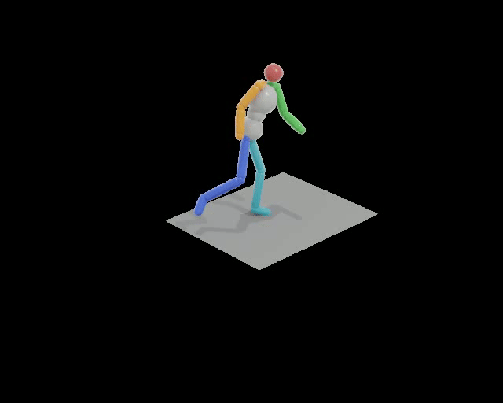
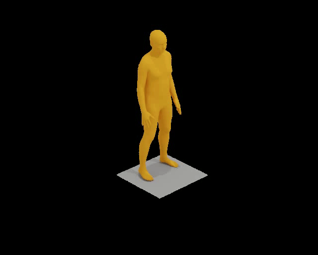
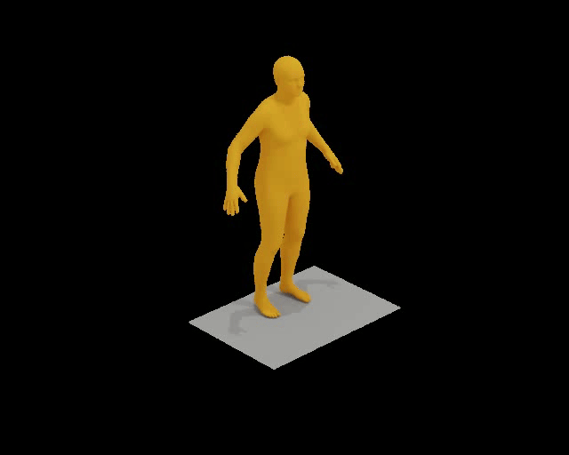
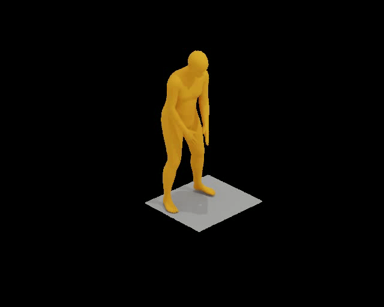

# Enhancing Text-to-Motion Synthesis through Language Models

## Demo
Our approach can enhance output motion quality by adding contextually relevant text signals or by translating high-level motion descriptions to a set of low-level motion descriptions.
In the following, we show 3 examples for qualitative improvements of the generated motion and one example for a degradation, where the LLM omitted important information.
Note that we subsequently built a quality check stage to minimize the occurrence of such refinement failures.

<table style="width: 100%; border-collapse: collapse;">
  <tr>
    <th style="border: 1px solid #ddd; padding: 8px; text-align: center; vertical-align: middle;">Ground Truth</th>
    <th style="border: 1px solid #ddd; padding: 8px; text-align: center; vertical-align: middle;">Unrefined (MoMask)</th>
    <th style="border: 1px solid #ddd; padding: 8px; text-align: center; vertical-align: middle;">Refined (Ours)</th>
  </tr>
  <tr>
    <td style="border: 1px solid #ddd; padding: 8px; text-align: center; vertical-align: middle;">
      
      <p style="max-width: 300px; margin: auto; word-wrap: break-word;">a person performs a typical broadjump</p>
    </td>
    <td style="border: 1px solid #ddd; padding: 8px; text-align: center; vertical-align: middle;">
      
      <p style="max-width: 300px; margin: auto; word-wrap: break-word;">a person performs a typical broadjump</p>
    </td>
    <td style="border: 1px solid #ddd; padding: 8px; text-align: center; vertical-align: middle;">
      
      <p style="max-width: 300px; margin: auto; word-wrap: break-word;">The person bends their arms and crouches down preparing for a jump, then extend their arms back as they propel themselves forward with their legs.</p>
    </td>
  </tr>
  <tr>
    <td style="border: 1px solid #ddd; padding: 8px; text-align: center; vertical-align: middle;">
      
      <p style="max-width: 300px; margin: auto; word-wrap: break-word;">a figure winds up for the pitch</p>
    </td>
    <td style="border: 1px solid #ddd; padding: 8px; text-align: center; vertical-align: middle;">
      
      <p style="max-width: 300px; margin: auto; word-wrap: break-word;">a figure winds up for the pitch</p>
    </td>
    <td style="border: 1px solid #ddd; padding: 8px; text-align: center; vertical-align: middle;">
      
      <p style="max-width: 300px; margin: auto; word-wrap: break-word;">The figure pulls back their arms in preparation for throwing something.</p>
    </td>
  </tr>
  <tr>
    <td style="border: 1px solid #ddd; padding: 8px; text-align: center; vertical-align: middle;">
      
      <p style="max-width: 300px; margin: auto; word-wrap: break-word;">person is performing a golf motion</p>
    </td>
    <td style="border: 1px solid #ddd; padding: 8px; text-align: center; vertical-align: middle;">
      
      <p style="max-width: 300px; margin: auto; word-wrap: break-word;">person is performing a golf motion</p>
    </td>
    <td style="border: 1px solid #ddd; padding: 8px; text-align: center; vertical-align: middle;">
      
      <p style="max-width: 300px; margin: auto; word-wrap: break-word;">Imitating a golf swing, the person assumes a stance and clasps their hand together in a golf grip, leans forward to simulate a put motion that swings from left to right.</p>
    </td>
  </tr>
  <tr>
    <td style="border: 1px solid #ddd; padding: 8px; text-align: center; vertical-align: middle;">
      
      <p style="max-width: 300px; margin: auto; word-wrap: break-word;">a person slowly walks in a counter clockwise circle</p>
    </td>
    <td style="border: 1px solid #ddd; padding: 8px; text-align: center; vertical-align: middle;">
      
      <p style="max-width: 300px; margin: auto; word-wrap: break-word;">a person slowly walks in a counter clockwise circle</p>
    </td>
    <td style="border: 1px solid #ddd; padding: 8px; text-align: center; vertical-align: middle;">
      
      <p style="max-width: 300px; margin: auto; word-wrap: break-word;">The person's arms are relaxed and swing gently with each step.</p>
    </td>
  </tr>
</table>


## SETUP

<details>

### Clone Repo

This repo relies on submodules ([MoMask](https://github.com/EricGuo5513/momask-codes)). Pull the whole repo with
```
git clone --recurse-submodules https://github.com/mkiefferus/DigitalHumans
```
External repos are found in the folder `external_repos`

### Setup MoMask Repo
<details>

*Disclaimer*: this section is the original setup-section from [MoMask](https://github.com/EricGuo5513/momask-codes). Please follow the link for further details.

### 1. Conda Environment
```
conda env create -f environment.yml
conda activate momask
pip install git+https://github.com/openai/CLIP.git
```
We test our code on Python 3.7.13 and PyTorch 1.7.1

#### Alternative: Pip Installation
<details>
We provide an alternative pip installation in case you encounter difficulties setting up the conda environment.

```
pip install -r requirements.txt
```
We test this installation on Python 3.10

</details>

### 2. Models and Dependencies

#### Download Pre-trained Models
```
bash prepare/download_models.sh
```

#### Download Evaluation Models and Gloves
For evaluation only.
```
bash prepare/download_evaluator.sh
bash prepare/download_glove.sh
```

#### Troubleshooting
To address the download error related to gdown: "Cannot retrieve the public link of the file. You may need to change the permission to 'Anyone with the link', or have had many accesses". A potential solution is to run `pip install --upgrade --no-cache-dir gdown`, as suggested on https://github.com/wkentaro/gdown/issues/43. This should help resolve the issue.

#### (Optional) Download Manually
Visit [[Google Drive]](https://drive.google.com/drive/folders/1b3GnAbERH8jAoO5mdWgZhyxHB73n23sK?usp=drive_link) to download the models and evaluators mannually.

### 3. Get Data

Follow the original [MoMask](https://github.com/EricGuo5513/momask-codes) repo to assemble the HumanML3D dataset.

</details>


### Setup Environment
Make sure to properly setup a separate environment with the `requirements.txt` file.
In case of any problems, these are the most important packages:
- spacy
- torch
- tqdm
- openai

Furthermore, you will need to download the ```en_core_web_sm``` model:
```
python -m spacy download en_core_web_sm
```

### Setup API Token

This project relies on LLMs for text refinement. Accessing these LLMs is done via the OpenAI client. When working with local language models, skip this part. 

When working with OpenAI models (GPT3.5-turbo, GPT4o, ...):
Please create an OPENAI API Token and export it as a global variable to your system. ```OPENAI_API_KEY = ".."```
Follow the instructions given in _"Step 2 - Set up your API key for all projects (recommended)"_ in the [OpenAI API Documentation](https://platform.openai.com/docs/quickstart?context=python) to configure your OpenAI API access.

</details>


## Motion Description Refinement

<details>

*Remember to switch to our environment for text refinement*

Use the `text_enhance.py` script to refine motion descriptions. This script provides 3 options:
1. Simple quality control
    ```
    python text_enhance.py --quality_control_only --system_prompt path/to/system/prompt -r
    ```
2. Prompt enhancement by similarity search in original dataset (see report)
    ```
    python text_enhance.py --prompt_adaptation --system_prompt path/to/system/prompt -r
    ```
3. Text refinement using LLMs
    ```
    python text_enhance.py -pa -sp path/to/system/prompt -r 
    ```

#### Additional Useful Flags

* `-v` : verbose
* `-s` : early stopping - stop refinement after x steps for testing purposes

Text Refinement
* `--continue_previous path/to/previous/folder` : continue refinement in folder
* `--refine_all_samples` : refine whole dataset, not only test-set (default)
* `--use_example path/to/example/json` : add additional context with assistant and user prompt
* `--use_cross_sample_information` : treat sample text file as one motion (ignores batch size)
* `--use_llama` : use llama instead of GPT3.5-turbo (default). Requires to also provide `--llama_key <key>`
* `--batch_size` : use file batching to speed up refinement (not recommended, leads to less detailed information and more inconsistency)

Quality control
* `-r` or `-d` : replace with original or delete refined files if they do not meet the quality control

</details>

## Train And Evaluate Your Own Model

<details>

*Remember to switch to the MoMask environment for training*

Use the `t2m_train_eval.py` script to manage the evaluation and training of different text-to-motion models. The script provides various options for training specific models, resuming training, and evaluating models.

1. Train Masked Transformer Model end-to-end
    ```
    python t2m_train_eval.py --train_mask --texts_folder_name path/to/texts/folder
    ```
2. Train Residual Transformer Model end-to-end
    ```
    python t2m_train_eval.py --train_res --texts_folder_name path/to/texts/folder
    ```
3. Evaluate All Metrics
    ```
    python t2m_train_eval.py --eval_all_metrics --texts_folder_name path/to/texts/folder
    ```
4. Evaluate Single Samples
    ```
    python t2m_train_eval.py --eval_single_samples --texts_folder_name path/to/texts/folder
    ```

### Additional Useful Flags

* `-v`, `--verbose` : Output information to the console (True) or the logfile (False).
* `-r`, `--resume_training` : Resume training that was stopped before.
* `--res_name` : Specify the Residual Transformer model to evaluate. Defaults to the original MoMask model.
* `--mask_name` : Specify the Masked Transformer model to evaluate. Defaults to the original MoMask model.

</details>

## Results Analysis

<details>

*Remember to switch to our environment for results analysis*

This repo also provides analysis scripts for post-processing under `result_analysis`. 

*Disclaimer* These scripts are not part of the original pipeline and were used to identify trends to further optimise the text refinement and training. They are guidelines and are no final products.

### BART Classifier

`BART_text_classifier.ipynb` leverages the [bart-large-mnli](https://huggingface.co/facebook/bart-large-mnli) model for zero-shot-classification. 

The `candidate_labels` variable holds a list with labels. The default confidence threshold is set to `THRESHOLD = 0.87`

Provide the link to the text samples folder unter `test_txt_path`. 

This is a multiclass classifier. It will label the data with the provided labels.

This script has the option to output the results to text files for further processing.


### Key-word Classifier

`filter_test_dataset.ipynb` filters test data based on keywords rather than using a classifier to label the test data. It currently tries to identify high level motion descriptions but also contains extensions to identify emotions, adjectives and limbs.

Adjust the `PROJECT_ROO_DIR` and the path variables.

This script has the option to output the results to text files for further processing.


### Semantic Analysis

Refined texts produced by LLMs often include semantic errors (hallucinated information, removal of relevant information). `semantic_check.py` aims to find these mistakes and filter them out.

An LLM (default: llama3) is fed the original motion description and the refined description and asked if the texts are roughly equivalent.

Use 
```
python result_analysis/semantic_check.py --data path/to/texts/folder -r
```

#### Additional Useful Flags

* `--model` : define model to be used (supports 'llama3' and 'gpt-3.5-turbo')
* `-r` : replace faulty prompt refinements with original texts
* `-v` : verbose

### Score Trend Analysis

`single_sample_score_analysis.ipynb` compares the performance of the original text files vs the performance of the refined text files.

It also shows the top 10 improved motion descriptions and the top 10 degradations with respect to the original data.

Adjust the `original` and `altered` variables, providing the paths to the two datasets respectively. 

</details>


## CONTRIBUTORS
- [Anne Marx](https://github.com/An-nay-marks)
- [Axel Wagner](https://github.com/Axel2017)
- [Max Kieffer](https://github.com/mkiefferus)
- [Michael Siebenmann](https://github.com/TheSiebi)
